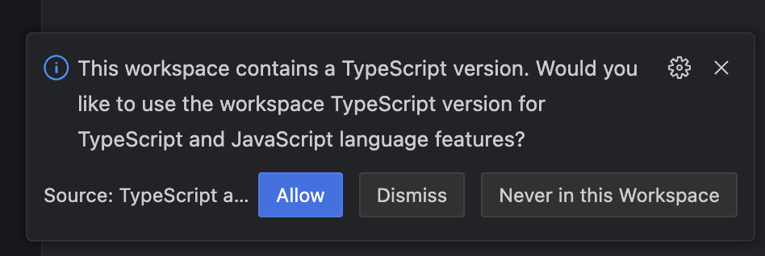

## How to run

1. Open [https://stackblitz.com/~/github.com/mizdra/repro-volar-get-language-id-error?file=example/index.ts](https://stackblitz.com/~/github.com/mizdra/repro-volar-get-language-id-error?file=example/index.ts)
1. When the following prompt appears, select "Allow".
    - 
1. Open tsserver log

Expected: Error message is output to the tsserver log.
Actual: Error message is not output to the tsserver log.
